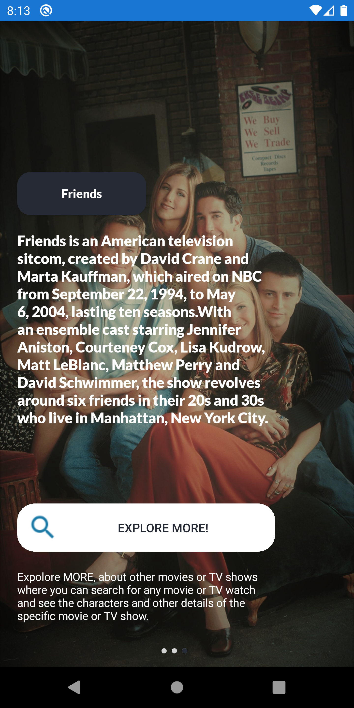
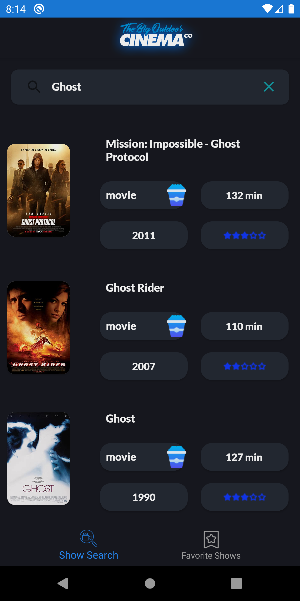
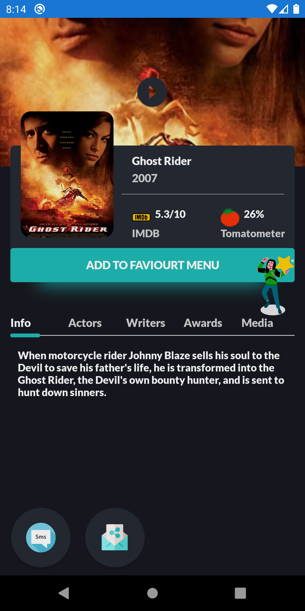
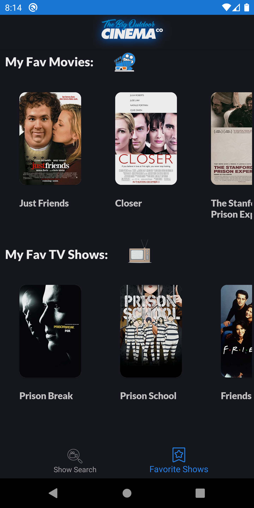

# **MovieBrowser**

### Description of the App:
IOS-Android app that is created with Xamarin (C# .NET), allows you to browse for movies and series and shows info about them (actors, description, rating, director...etc.) and add them to favourite or watch later, it also shows the rates from different sites.
* **this project is useful for purpose of learning for:**
  * C# developers that has the knowledge of OOP (Object orinted programming).
  * C# developers that has the knowledge of Xamarin cross-platform Mobile Framework with XAML.
  * C# developers that worked before with the **MVVM** structure.
 
 #### - Screenshots of the internal app after building:
</img>
</img>
</img>
</img>

* for the purpose of the Copyrights (credits) the following is used:
  * API: https://www.themoviedb.org/
